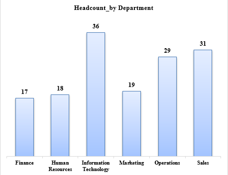
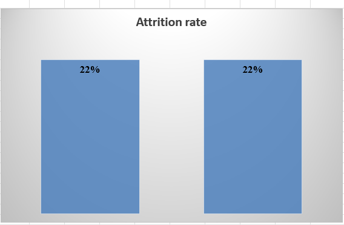
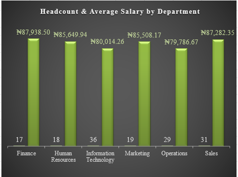
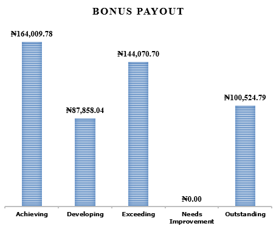
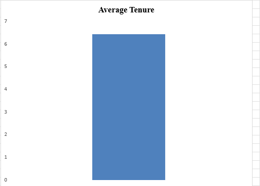

# HR Analytics Dashboard | Excel Data Analytics Capstone

## Business Problem
Effective workforce planning depends on reliable and accessible employee data. However, organizations that rely on legacy Human Resource Information Systems (HRIS) often face challenges arising from inconsistent data structures, duplicate records, missing information, and coded values that limit meaningful analysis.
In this project, the HR department provided an export from its legacy system containing raw employee records that were unsuitable for strategic reporting. The absence of standardized data prevented management from accurately evaluating workforce distribution, employee retention, compensation trends, performance outcomes, and projected bonus obligations.

---

## Project Objectives
The primary objective of this project was to demonstrate the complete data analytics workflow within Microsoft Excel by converting unstructured HR data into meaningful business insights.
Specifically, the project sought to:
- Improve data quality through cleaning, validation, and standardization.
- Transform employee records into an analysis-ready dataset using advanced Excel formulas.
- Evaluate key workforce indicators such as headcount, attrition, employee performance, salary distribution, and bonus allocation.
- Develop interactive Pivot Tables and visualizations to summarize workforce trends.
- Design an executive dashboard that enables HR managers to monitor key performance indicators and make informed strategic decisions.

---

## Executive Summary
The HR analytics project analysis revealed a workforce of 150 employees distributed across six departments, with an overall attrition rate of approximately 22%. This indicates that more than one in five employees are no longer active, emphasizing the need for continuous monitoring of employee retention to minimize recruitment costs, productivity losses, and the impact on organizational knowledge.
The analysis also identified notable differences in workforce distribution and compensation across departments. The Information Technology department has the largest workforce with 36 employees, while Finance, despite having the smallest workforce of 17 employees, records the highest average salary (≈ 87,939). In contrast, Operations has the lowest average salary (≈ 79,787), highlighting variations in compensation structures that may reflect differences in job responsibilities, seniority, and departmental priorities.
Performance and reward analysis further revealed that employees who have resigned recorded the highest average performance scores, suggesting that the organization may be losing high-performing talent. Although additional investigation is required to determine the underlying causes, this finding underscores the importance of strengthening employee engagement and retention strategies. Furthermore, the projected annual bonus payout of approximately 496,463 demonstrates a substantial investment in performance-based rewards, with the majority of bonus allocations directed toward higher-performing employees.
Additionally, the workforce's average tenure of 6.44 years reflects a moderate level of organizational experience, offering valuable context for succession planning, talent development, and long-term human capital management.

---

## Key Business Insights
The analysis uncovered several findings that can support strategic human resource management.

- The organization employs 150 staff members distributed across six departments, providing a balanced workforce for operational activities.

- The overall attrition rate is approximately 22%, indicating that more than one in five employees are no longer active. This level of turnover may increase recruitment costs, reduce productivity, and contribute to the loss of institutional knowledge if not effectively managed.

- The Information Technology department represents the largest workforce with 36 employees, while Finance has the smallest workforce with 17 employees. These differences provide useful context for workforce planning and resource allocation.

- Finance records the highest average salary (≈ 87,939), whereas Operations records the lowest average salary (≈ 79,787). These differences may reflect varying job complexity, departmental responsibilities, and compensation policies.

- Employees classified as Resigned recorded the highest average performance scores, suggesting that high-performing talent may be leaving the organization. Although additional investigation is required to determine the underlying causes, this trend highlights a potential retention challenge.

- The projected annual bonus payout of approximately 496,463 demonstrates a significant investment in performance-based compensation, with higher-performing employees receiving the largest share of bonus allocations.

- Employees have an average tenure of 6.44 years, reflecting a workforce with moderate organizational experience and valuable institutional knowledge.

---

## Business Recommendations
Based on the findings, several recommendations can enhance workforce management and organizational performance.
- Strengthen employee retention initiatives by identifying and addressing factors contributing to employee turnover.
- Conduct targeted exit interviews and engagement surveys to better understand why high-performing employees leave the organization.
- Review departmental compensation structures periodically to ensure fairness, competitiveness, and alignment with organizational objectives.
- Continue leveraging performance-based reward systems while regularly evaluating their effectiveness in motivating employees and retaining top talent.
- Integrate the dashboard into routine HR reporting to support ongoing workforce monitoring, strategic planning, and evidence-based decision-making.

---

## Conclusion
This project demonstrates the complete analytics lifecycle—from transforming a raw and inconsistent dataset into a reliable source of business intelligence to communicating actionable insights through an interactive dashboard.
Beyond developing technical proficiency in Microsoft Excel, the project highlights the importance of combining data preparation, analytical thinking, and visualization to solve real business problems. The resulting dashboard provides HR decision-makers with a practical tool for monitoring workforce performance, evaluating employee retention, planning compensation strategies, and supporting long-term organizational growth.

---

## Tools and Technologies
### Software
- Microsoft Excel
- Excel Features
- Advanced Formulas
- XLOOKUP
- Pivot Tables
- Pivot Charts
- Slicers

---

## Skills Demonstrated
- Data Cleaning
- Data Transformation
- Exploratory Data Analysis (EDA)
- HR Analytics
- Dashboard Design
- Data Visualization
- KPI Development
- Business Intelligence
- Data Storytelling